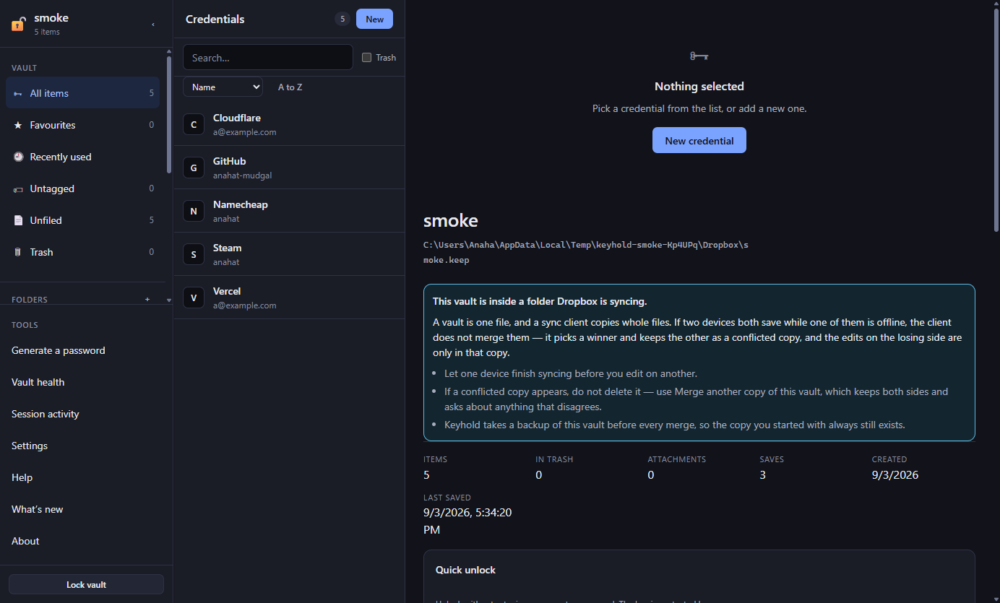
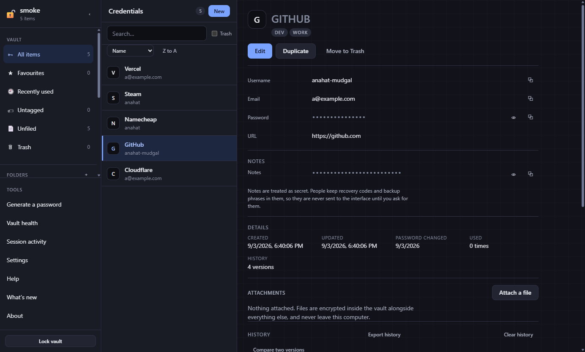
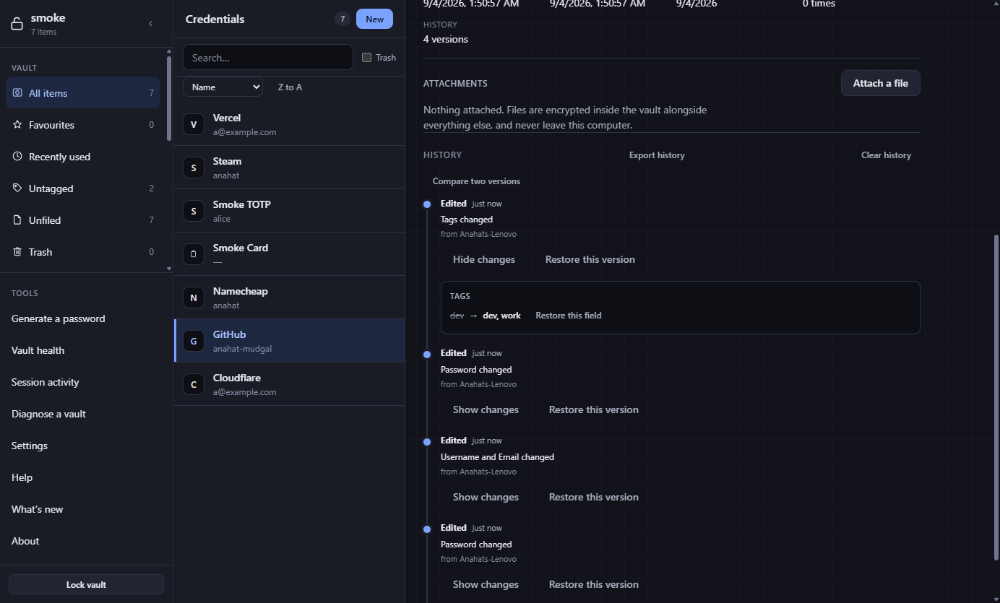
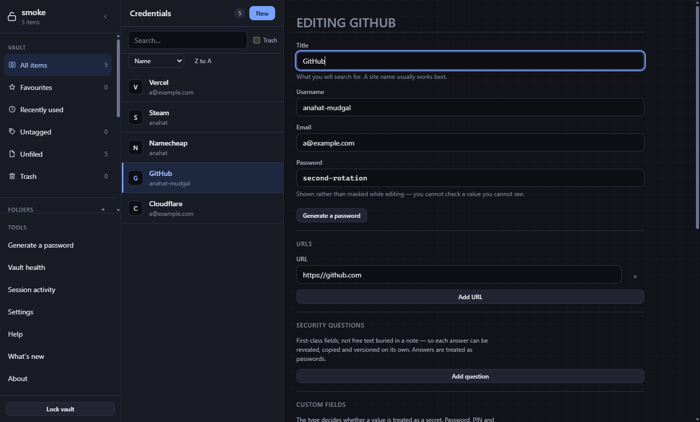
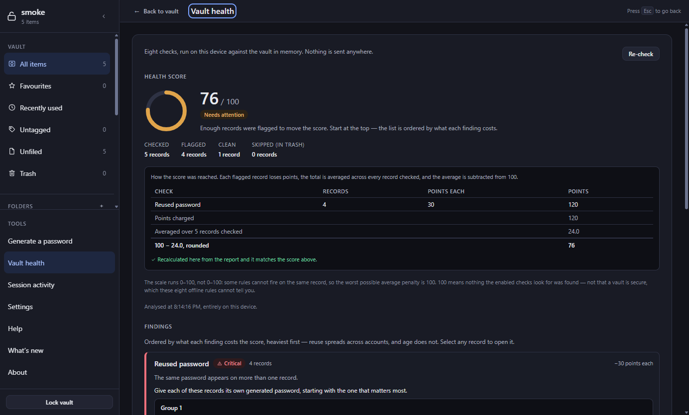
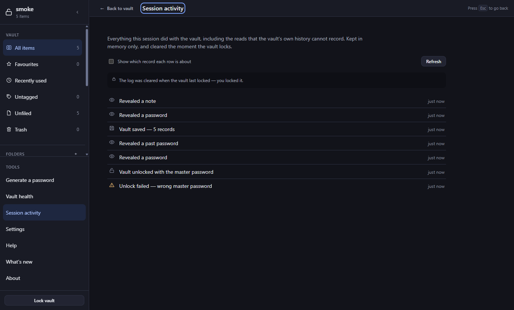

<p align="center">
  
</p>

<h1 align="center">Keyhold</h1>

<p align="center">
  <strong>A fully offline password manager that records what changed, when, and from which device and network — in one encrypted file you own.</strong>
</p>

<p align="center">

[](https://www.electronjs.org)
[](https://www.typescriptlang.org)
[](https://react.dev)
[](#)
[](LICENSE)

[](https://anahatmudgal.com)
[](https://github.com/anahatm)

</p>

> [!WARNING]
> **Keyhold is a work-in-progress and has not been audited.** The vault format, the cryptography and the core CRUD are built and tested; several features are still landing. Do not trust it with your only copy of anything yet.

---

## What is Keyhold?

Keyhold keeps your credentials in a single encrypted file on your own disk. There is no account, no server, no sync service and no telemetry — the app makes exactly zero network requests, and the one exception planned (a breach check) is opt-in and off by default. You copy the file to another machine and it opens there, because the key comes from your master password and nothing else.

What it does that other free, local managers do not: **it records where every change came from.** Each edit stores which fields moved, what they held before, and — at a privacy level you choose — the device, the account and the network it happened from. That trail lives inside the encrypted body, so it travels with the vault and the file itself reveals none of it. Every entry in the timeline is a state you can restore, and restoring is itself recorded, so the one operation that rewrites a record is not the one the audit trail cannot see.

It is free, GPL-3.0, and there is nothing to pay for and nothing to host.

---

## Key Features

- **Version history with a device and network audit trail** — per-credential, opt-in, with four privacy levels (`none` / `device` / `network` / `full`) enforced at the moment of capture rather than at display, so a field you chose not to record was never written to the file at all.

- **Encrypted with Argon2id and AES-256-GCM** — envelope encryption, so changing your master password rewraps a key rather than re-encrypting the vault. The KDF cost is calibrated to your machine on creation and can never be set below a floor.

- **The renderer never holds your secrets** — the UI receives a projection carrying titles, usernames and lengths, and asks for one secret at a time through a rate-limited, TTL-scoped broker that is emptied the moment you lock. A compromised window is not a compromised vault.

- **A vault that is one file** — `.keep`. Copy it, back it up, put it on a USB stick, keep it in your own cloud folder if you want to. Atomic writes with rotating backups, and an interrupted write is quarantined rather than deleted.

- **Unlimited custom fields** — 13 types, reorderable, individually hidden, alongside usernames, emails, multiple URLs, security questions and notes. Notes are treated as secret, because people keep recovery codes in them.

- **Import from the manager you are leaving** — eighteen formats: Bitwarden (CSV and JSON), LastPass, Chrome/Edge/Brave, Firefox, Safari, 1Password (CSV and the `.1pux` archive), Dashlane (CSV and JSON), NordPass, KeePass CSV, Proton Pass, Enpass, Keeper, RoboForm, Keyhold's own JSON export, and a generic CSV mapper for everything else. Nothing is dropped silently; anything that could not be carried is named.

- **An import you can take back** — a dry run over the real parse, so what you approve is exactly what gets written; duplicate detection against your vault; a merge that fills empty fields and never removes a URL or moves a record out of the folder you filed it in; and an undo that refuses rather than swallowing an edit you made in the meantime.

- **Export you can actually leave with** — lossless Keyhold JSON, a flat CSV, Bitwarden's exact column set for moving to another manager, and an encrypted `.keepx` parcel for sending. Spreadsheet formula injection is neutralised, and the cost of doing so is reported rather than hidden.

- **An offline health check** — reuse (with the cluster, so you know _which_ records), weak, old, expiring, insecure `http://` URLs, likely duplicates. Scored with weights that are written down and arguable rather than opaque, and the report can never contain a password.

- **A password generator with honest entropy** — random, passphrase over the real EFF wordlist, pronounceable and PIN. The entropy reported is computed from the alphabet that remains after your exclusions, and it is _charged_ for guaranteeing one character of each class rather than overstating it.

- **Search that ranks** — field prefixes, quoted phrases, `is:` and `has:` flags, negation, diacritic-insensitive matching, and a total, stable sort. Notes and security answers are searched in the main process, which returns only matching ids.

- **Eight themes, and a design system with a contrast guard** — every colour is a token, and a test fails the build if any theme drops a pair below its WCAG 2.2 AA minimum.

- **A session activity log** — what this session unlocked, revealed, copied and saved, which is the one question a password manager otherwise cannot answer: _did something just walk my vault?_ Held in memory only and cleared the moment you lock, because a durable record of which credentials were read is a second, unencrypted index of what is in the vault.

- **Saved searches** — name a query and it lives in the sidebar. Stored inside the vault, so it travels with the file rather than staying on one computer.

- **Changing the master password is instant** — envelope encryption means it re-wraps one 32-byte key and rewrites a header, whether the vault holds ten records or ten thousand. Your records are never re-encrypted, so there is no long, dangerous-looking operation to talk yourself out of.

---

## How it compares, honestly

Keyhold is not the right password manager for everyone, and the places it loses are not
footnotes. This table is the same one in
[`docs/00-Overview/02-Competitive-Analysis.md`](docs/00-Overview/02-Competitive-Analysis.md),
put here rather than buried, because "it doesn't autofill" is better learned from a README
than from a one-star review.

| Where others win               | Who                                                | Where Keyhold stands                                                                                                                                             |
| ------------------------------ | -------------------------------------------------- | ---------------------------------------------------------------------------------------------------------------------------------------------------------------- |
| **Browser autofill**           | Everyone except `pass`                             | Not built. This is the single biggest gap, and for a lot of people it is the whole decision                                                                      |
| **Mobile apps**                | Bitwarden, Proton, 1Password, the KeePassXC family | Not in scope, and not currently mitigated — KDBX export is designed but not built, so today there is no clean path onto a phone                                  |
| **Third-party security audit** | Bitwarden, Proton, 1Password, KeePassXC            | None, and none claimed. What there is instead: a written threat model, a small readable codebase, and a published format spec anyone can implement a reader from |
| **Hardware keys / YubiKey**    | KeePassXC                                          | Not built. The envelope design already accommodates it — a hardware key would be another wrapping of the same data key — but it is a plan, not a feature         |
| **Maturity**                   | KeePassXC, Bitwarden                               | A new project that has never been trusted with anybody's real vault. The answer is obsessive data-loss protection, not a claim of stability it has not earned    |
| **Team sharing**               | Bitwarden, Passbolt, Psono                         | A deliberate non-goal. `.keepx` parcels cover handing a few credentials to one person, and nothing more                                                          |
| **A memory-safe runtime**      | KeePassXC (C++/Qt)                                 | Electron is a fair criticism and there is no way to argue it away. It is why no secret is allowed into the renderer process at all                               |

Where it wins is narrower and more specific: it is the only free, serverless, local manager
that records **where every change came from**, and it is one file you own with no account
attached to it.

---

## Screenshots

|           |  |
| :---------------------------------------------------------------------------------------: | :----------------------------------------------------------------------: |
| The vault, and an unprompted warning that this file is inside a folder Dropbox is syncing |    Version history, with the device and network each change came from    |

|  |  |
| :----------------------------------------------------------: | :---------------------------------------------------------: |
|            What one edit changed, field by field             |               The editor, with custom fields                |

|  |  |
| :------------------------------------------------------------: | :----------------------------------------------------------------: |
|         Ten offline health checks over the whole vault         |   What this session read, revealed and copied — cleared on lock    |

> Generated from the real app rather than hand-made:
> `npm run build && node tools/smoke.mjs --shots docs/images`
>
> The smoke run seeds a deterministic vault, drives the UI through it by clicking real
> controls, and captures fifteen named views — so a screenshot here cannot quietly stop
> matching the app it claims to show. Regenerating them is one command.

---

## How it is built

| Layer            | What it owns                                                                                                                                             |
| ---------------- | -------------------------------------------------------------------------------------------------------------------------------------------------------- |
| **Main process** | Every secret — the key-encryption key, the data key, the decrypted vault. Crypto, the KEEP container, atomic writes, history, health, import and export. |
| **Preload**      | The only bridge. Every member enumerated by hand; no generic `invoke`, no state, no listener on a channel the renderer chose.                            |
| **Renderer**     | The safe projection and nothing more. Sandboxed, context-isolated, `default-src 'none'`, and it throws rather than starting without context isolation.   |

The vault file is a **KEEP** container — _Keyhold Encrypted Entry Package_: a magic string, a version, a plaintext JSON header used as the AEAD's additional authenticated data, a sealed body, and length-prefixed attachment chunks each bound to its own id. The format is documented in full at [`docs/04-Vault-Format/`](docs/04-Vault-Format/) so anyone can write a reader.

## Built With


---

<details>
<summary><strong>💾 Installing a downloaded build — and why your OS will warn you</strong></summary>

Keyhold ships **unsigned**, and your operating system will say so. That is worth being
straight about rather than papering over: the whole pitch is that you should not have to
trust a company with your passwords, so it would be a poor start to hide the fact that your
OS cannot verify who built the binary. It genuinely cannot. Code-signing certificates cost
$99–400 a year, and this project has decided not to spend money it would then have to
recover.

**Windows.** Running the installer produces a blue **"Windows protected your PC"** dialog
from SmartScreen. There is no visible way forward until you click **More info**, which
reveals **Run anyway**. If the download was blocked outright, nothing will happen at all
when you run it — right-click the file → **Properties** → tick **Unblock** → **OK**, then
run it again. The UAC prompt will show **Publisher: Unknown**, which is accurate.

SmartScreen reputation does not accrue for unsigned software: the warning looks the same on
the ten-thousandth download as on the first. Verify the published checksum if you want more
assurance than the dialog can give you.

**macOS.** The app is ad-hoc signed rather than truly unsigned, which matters — on Apple
Silicon a genuinely unsigned binary will not launch at all, and macOS offers only "Move to
Bin". Ad-hoc signing costs nothing and gets you to the ordinary unidentified-developer
prompt instead, which has a way through: launch the app, let it be refused, then open
**System Settings → Privacy & Security**, scroll to the bottom, and click **Open Anyway**.
The old right-click → **Open** trick was removed in recent macOS versions; instructions
elsewhere on the internet that still recommend it are out of date.

> The macOS wording is **unverified** — there is no Mac on this project yet. If it differs
> on your machine, please open an issue and say what it actually said.

</details>

<details>
<summary><strong>📦 Building from source</strong></summary>

```bash
git clone https://github.com/AnahatM/Keyhold
cd Keyhold
npm install

npm run dev          # run in development
npm run verify       # lint, typecheck and the unit suite
npm run build        # build main, preload and renderer
npm run test:smoke   # launch the real app and drive it end to end
```

`npm run test:smoke` is the one check that exercises a real Electron window. It exists because the defect it was written for — a sandboxed ESM preload — builds cleanly, launches cleanly, and silently leaves `window.keyhold` undefined. It refuses to run against a stale build.

</details>

<details>
<summary><strong>📚 Documentation</strong></summary>

The full documentation tree is in [`docs/`](docs/_INDEX.md), and it is written to be read rather than generated:

| Folder                                             | Covers                                                                               |
| -------------------------------------------------- | ------------------------------------------------------------------------------------ |
| [`00-Overview`](docs/00-Overview/)                 | What Keyhold is, the naming and glossary, the competitive analysis, the threat model |
| [`01-Architecture`](docs/01-Architecture/)         | The process model, the safe projection, the IPC surface                              |
| [`02-Security`](docs/02-Security/)                 | Cryptography, process hardening, the session and lock model                          |
| [`03-Data-Model`](docs/03-Data-Model/)             | The record schema and what counts as secret                                          |
| [`04-Vault-Format`](docs/04-Vault-Format/)         | The KEEP container specification                                                     |
| [`05-Features`](docs/05-Features/)                 | Generator, health rules, history and audit, search                                   |
| [`06-UI-Design-System`](docs/06-UI-Design-System/) | Tokens, themes, layout, app chrome                                                   |
| [`09-Import-Export`](docs/09-Import-Export/)       | Every format, with per-format field mapping                                          |
| [`12-Roadmap`](docs/12-Roadmap/)                   | The master checklist, the feature backlog, the decision log                          |

</details>

---

## Security

Keyhold has **not** been independently audited. The threat model — including what it deliberately does not protect against — is written out in [`docs/00-Overview/03-Threat-Model.md`](docs/00-Overview/03-Threat-Model.md), and the reporting process is in [`SECURITY.md`](SECURITY.md).

One thing worth knowing before you start: **there is no password recovery.** The master password is the only way in, by design. If it is lost, the vault is gone.

---

## Author

**Anahat Mudgal**

- Website: [anahatmudgal.com](https://anahatmudgal.com)
- GitHub: [@AnahatM](https://github.com/anahatm)

---

## License

This project is free software under the [GNU General Public License v3.0 or later](LICENSE).
